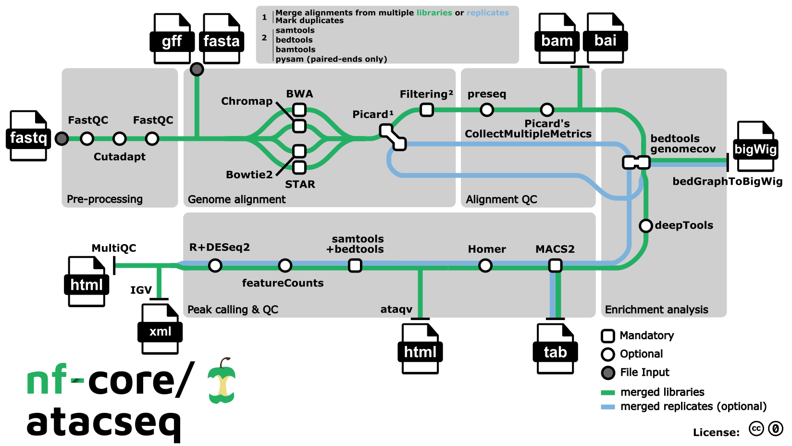

```{r setup, include=FALSE}
knitr::opts_chunk$set(echo = TRUE)
```

## Installing Packages
```{r install-packages, eval=FALSE}
# every single install.packages() command we ran on fiji (may not be exhaustive)
# NOTE: This chunk is set to eval=FALSE.
# Run these lines interactively in your R console
# *only* if you need to install these packages.
# If running on a system where packages are already installed,
# you can ignore this.
# may need to be commented out if not compliling locally
options(repos = c(CRAN = "https://cloud.r-project.org"))
install.packages(c("tidyverse",
                   "pheatmap",
                   "textshape",
                   "Rcpp",
                   "magrittr",
                   "ggplot2",
                   "dplyr",
                   "IRanges",
                   "purrr",
                   "readr",
                   "tibble",
                   "tidyr",
                   "eulerr",
                   "ChIPseeker",
                   "patchwork"))
# install BiocManager
if (!requireNamespace("BiocManager", quietly = TRUE))
  install.packages("BiocManager")
BiocManager::install(version = "3.20") # specify version if needed
BiocManager::install(c("ChIPseeker",
                       "DESeq2",
                       "apeglm",
                       "rtracklayer",
                       "biomaRt",
                       "txdbmaker",
                       "org.Mm.eg.db"))
source("util/useful_functions.R")
```

## Loading Required Libraries
```{r load-libraries, message=FALSE, warning=FALSE}
# loading in every library we used over the semester
library(tidyverse)
library(DESeq2)
library(magrittr)
library(ggplot2)
library(IRanges)
library(pheatmap)
library(textshape)
library(Rcpp)
library(GenomicRanges)
library(rtracklayer)
library(eulerr)
library(ChIPseeker)
library(biomaRt)
library(dplyr)
library(patchwork)
library(GenomicFeatures)
library(txdbmaker)
library(org.Mm.eg.db)
```

## Loading Data
```{r load-data, eval=TRUE}
# Load the data
load("ATACSeqData/key_mouse_atac_data.RData")
load("DESeqResults/DESEQ_results.rdata")
unique_to_dox <- import("ATACSeqData/unique_to_dox.bed")
unique_to_non_dox <- import("ATACSeqData/unique_to_non_dox.bed")
gencode_gtf <- import("ATACSeqData/gencode.vM25.annotation.gtf",
                      feature.type = "gene")
```

```{r clean-chroms, message=FALSE}
# ── 3‑chromosome harmonisation to UCSC style ──────────────────────────────
std_chroms <- c(paste0("chr", 1:19), "chrX", "chrY", "chrM")

canonise <- function(gr) {
  # ensure UCSC style first
  GenomeInfoDb::seqlevelsStyle(gr) <- "UCSC"
  # find which of the standard chromosomes are actually present in the object
  seqlevels_to_keep <- intersect(std_chroms, GenomeInfoDb::seqlevels(gr))
  # keep only those that are present
  GenomeInfoDb::keepSeqlevels(gr, seqlevels_to_keep, pruning.mode = "coarse")
}

# apply to every GRanges object used downstream
common_peaks        <- canonise(common_peaks)
unique_to_dox       <- canonise(unique_to_dox)
unique_to_non_dox   <- canonise(unique_to_non_dox)

proms <- GenomicFeatures::promoters(gencode_gtf,
                                    upstream = 2000,
                                    downstream = 2000)
# assign gene_id before canonising proms
# use mcols() to access metadata
mcols(proms)$gene_id <- mcols(proms)$gene_id
# apply canonise to proms as well
proms <- canonise(proms)
```

## Abstract
Chromatin accessibility is often viewed as a prerequisite for rapid transcriptional responses, yet the relationship can be context-dependent. Here we profiled open chromatin in mouse embryonic stem cells (mESCs) across a 2.5-hour doxycycline (dox) time-course (0, 30, 60, 90, 120, 150 min; one biological replicate each) using the nf-core/ATAC-seq v2.1.2 pipeline. MACS2 identified 70-100k broad peaks per sample. A custom find_common_peaks workflow revealed 37,152 constitutive peaks shared by all time points, mapping preferentially to promoters of protein-coding genes (≈ 48% overlap).
To pinpoint dynamic sites, we (i) compared common-peak sets between 0 min and all dox-treated samples and (ii) applied DESeq2 to nf-core-generated featureCounts for 159,000 consensus peaks. Only 1,549 peaks emerged as “gained” and 16,312 as “lost” by simple overlap, yet DESeq2 detected no peaks with adjusted p < 0.05, even after low-count filtering and shrinkage. In contrast, matched RNA-seq data revealed > 900 differentially expressed genes.
Our results indicate that dox elicits pronounced transcriptomic changes without large-scale chromatin opening or closing, implying a chromatin-independent mechanism — such as modulation of transcriptional machinery or RNA stability—during the early response window. These findings refine the paradigm that accessibility shifts are a universal correlate of rapid gene regulation and provide a high-confidence set of 37k constitutive ATAC sites that define the basal mESC state.

## Introduction
### Biological context
Chromatin accessibility governs which regulatory elements are competent to engage transcriptional machinery. In mouse embryonic stem cells (mESCs), open chromatin marks core pluripotency genes and thousands of distal enhancers that together maintain the naïve state. Acute environmental or chemical cues can trigger rapid transcriptional re-programming, often—but not always—preceded by local chromatin remodelling.
Doxycycline (dox) is widely used as an inducer in Tet-ON/OFF systems; however, multiple reports note pleiotropic effects on mitochondrial function, stress pathways, and global mRNA levels independent of the transgene of interest. Whether these transcriptomic shifts require accompanying changes in chromatin accessibility during the first few hours of exposure remains unresolved.

### Experimental question & hypothesis
Question. Does short-term (≤ 150 min) doxycycline exposure reshape the open-chromatin landscape in mESCs?
Hypothesis. Early transcriptional responses to dox occur largely without widespread opening or closing of chromatin, implying a mechanism that acts downstream of accessibility (e.g. altered transcriptional elongation, mRNA stability, or mitochondrial retrograde signalling).

### Study design

We performed nf-core/ATAC-seq (v2.1.2) on biological replicates collected at 0 min (non-dox) and five post-treatment time points (30-150 min). MACS2 broad peaks and nf-core-generated featureCounts tables provided the basis for:

Peak landscape QC - per-sample counts, FRiP, constitutive peak set.

Binary overlap analysis - “closing” vs “opening” peaks between 0 min and post-dox samples.

Quantitative testing - DESeq2 on read counts for 159k consensus peaks.

Functional annotation - intersection with GENCODE vM25 promoters and RNA-seq differential genes.

Manual validation - IGV inspection of top statistical and overlap candidates.


### Pipeline overview
```{r pipeline-overview, echo=FALSE, fig.cap="nf-core/ATAC-seq pipeline overview", out.width="100%"}

```
The nf-core/ATAC-seq pipeline (Figure 1) automated all primary processing steps—pre-processing, genome alignment, QC, peak calling, and per-peak quantification—ensuring a reproducible foundation for downstream analyses.

## Results
### 3.1 Peak-landscape quality control

```{r fig-counts, fig.width = 5, fig.height = 3, message = FALSE}
peak_counts <- tibble(
  sample = names(my_peaks),
  peaks  = sapply(my_peaks, length)
)

ggplot(peak_counts, aes(reorder(sample, peaks), peaks)) +
  geom_col(fill = "steelblue") +
  coord_flip() +
  labs(y = "Broad peaks per sample", x = "",
       title = "Peak burden across libraries") +
  theme_minimal(base_size = 10)

ggsave("figures/peak_counts.png",
       width = 5, height = 3, dpi = 300)
```

### 3.2 Facet Plot of Intersection Counts
```{r facet-plot, fig.width = 10, fig.height = 6}
# create a data frame for all comparisons
venn_data <- tibble::tibble(
  Comparison = rep(c("0 min vs 30 min", "0 min vs 60 min", "0 min vs 90 min",
                     "0 min vs 120 min", "0 min vs 150 min"), each = 3),
  Set = rep(c("0 min", "Timepoint", "Intersection"), times = 5),
  Count = c(
    length(my_peaks$WT_control_0),
    length(my_peaks$WT_control_30),
    length(GenomicRanges::intersect(my_peaks$WT_control_0, my_peaks$WT_control_30)),
    length(my_peaks$WT_control_0),
    length(my_peaks$WT_control_60),
    length(GenomicRanges::intersect(my_peaks$WT_control_0, my_peaks$WT_control_60)),
    length(my_peaks$WT_control_0),
    length(my_peaks$WT_control_90),
    length(GenomicRanges::intersect(my_peaks$WT_control_0, my_peaks$WT_control_90)),
    length(my_peaks$WT_control_0),
    length(my_peaks$WT_control_120),
    length(GenomicRanges::intersect(my_peaks$WT_control_0, my_peaks$WT_control_120)),
    length(my_peaks$WT_control_0),
    length(my_peaks$WT_control_150),
    length(GenomicRanges::intersect(my_peaks$WT_control_0, my_peaks$WT_control_150))
  )
)

# Plot using ggplot2 with facets
ggplot(venn_data, aes(x = Set, y = Count, fill = Set)) +
  geom_bar(stat = "identity", position = "dodge") +
  facet_wrap(~Comparison, scales = "free") +
  labs(
    title = "Venn Diagram Counts for Timepoint Comparisons",
    y = "Count"
  ) +
  theme_minimal(base_size = 12) +
  theme(legend.position = "none")

ggsave("figures/intersection_counts.png",
       width = 10, height = 6, dpi = 300)
```

### 3.3 Constitutive peaks
```{r constitutive-peaks, fig.width = 10, fig.height = 6}
gencode_gtf_path <- "ATACSeqData/gencode.vM25.annotation.gtf" # Define the path
if (!file.exists("ATACSeqData/txdb_gencode_vM25.sqlite")) {
  txdb_gencode <- GenomicFeatures::makeTxDbFromGFF(gencode_gtf_path, format = "gtf")
  saveDb(txdb_gencode, file = "ATACSeqData/txdb_gencode_vM25.sqlite")
} else {
  txdb_gencode <- loadDb("ATACSeqData/txdb_gencode_vM25.sqlite")
}

GenomeInfoDb::seqlevelsStyle(txdb_gencode) <- "UCSC"
```
```{r pie-chart, fig.width = 10, fig.height = 10}
# keep only chr1‑chr19, chrX, chrY, chrM
common_clean <- canonise(common_peaks)

# Annotate -----------------------------------------------------------------
annot <- annotatePeak(
  common_clean,
  TxDb      = txdb_gencode,
  tssRegion = c(-2000, 2000),
  annoDb    = "org.Mm.eg.db",
  verbose   = FALSE
)

ann <- as.data.frame(annot)

# Collapse labels ----------------------------------------------------------
ann$cat <- dplyr::case_when(
  grepl("Promoter",   ann$annotation) ~ "Promoter",
  grepl("UTR",        ann$annotation) ~ "UTR",
  grepl("Exon",       ann$annotation) ~ "Exon",
  grepl("Intron",     ann$annotation) ~ "Intron",
  grepl("Downstream", ann$annotation) ~ "Downstream",
  TRUE                               ~ "Distal Intergenic"
)

# Palette & pie ------------------------------------------------------------
pal <- RColorBrewer::brewer.pal(6, "Pastel2")
names(pal) <- c("Promoter","UTR","Exon","Intron","Downstream","Distal Intergenic")

pie(table(ann$cat),
    col    = pal[names(table(ann$cat))],
    radius = 1,
    main   = "Genomic distribution of 37 k constitutive peaks")

```

### 3.4 Non-dox vs dox overlaps - “closing” and “opening” peaks
```{r closing-opening-peaks, fig.width = 10, fig.height = 6}
# Define “lost” (closing) and “gained” (opening) peaks
closing_peaks <- unique_to_non_dox      # present at 0 min, absent post‑dox
opening_peaks <- unique_to_dox          # absent at 0 min, present post‑dox

overlap_counts <- dplyr::tibble(
  Category = c("Closing (lost)", "Opening (gained)"),
  Count    = c(length(closing_peaks), length(opening_peaks))
)

ggplot(overlap_counts,
       aes(x = Category, y = Count, fill = Category)) +
  geom_col(width = 0.6, colour = "black") +
  scale_fill_manual(values = c("#cb181d", "#2171b5")) +  # red / blue
  geom_text(aes(label = Count), vjust = -0.4, size = 3) +
  labs(y = "Peak count", x = NULL,
       title = "Binary overlap: peaks lost vs gained (0 min → dox)") +
  theme_minimal(base_size = 10) +
  theme(legend.position = "none")
```

### 3.5 Promoter enrichment         - stacked bar (mRNA vs lncRNA)
```{r promoter-enrichment, fig.width=10, fig.height=6, message=FALSE, warning=FALSE}
gencode_gtf_path <- "ATACSeqData/gencode.vM25.annotation.gtf"

# ── 1. promoter peaks from `annot` ────────────────────────────────────────
promoter_peaks <- as.data.frame(annot) %>% 
  dplyr::filter(grepl("Promoter", annotation)) %>% 
  dplyr::filter(!is.na(geneId)) %>% 
  dplyr::mutate(gene_id = sub("\\..*$", "", geneId))

# ── 2. grab biotype, accommodating gene_type / gene_biotype  ─────────────
gtf_gene_info <- rtracklayer::import(
  gencode_gtf_path, feature.type = "gene"
) %>% 
  as.data.frame()

biotype_col <- intersect(c("gene_biotype", "gene_type"), colnames(gtf_gene_info))[1]

gtf_gene_info <- gtf_gene_info %>% 
  dplyr::select(gene_id, gene_biotype = !!biotype_col) %>% 
  dplyr::mutate(gene_id = sub("\\..*$", "", gene_id))

# ── 3. annotate & summarise ──────────────────────────────────────────────
promoter_summary <- promoter_peaks %>% 
  dplyr::left_join(gtf_gene_info, by = "gene_id") %>% 
  dplyr::mutate(Category = dplyr::case_when(
    gene_biotype == "protein_coding" ~ "mRNA",
    gene_biotype == "lncRNA"         ~ "lncRNA",
    is.na(gene_biotype)              ~ "Unknown/No Biotype",
    TRUE                             ~ "Other Biotype"
  )) %>% 
  dplyr::count(Category, name = "Count") %>% 
  dplyr::mutate(
    Total      = sum(Count),
    Percentage = 100 * Count / Total,
    Label      = sprintf("%d\n(%.1f%%)", Count, Percentage),
    Category   = factor(Category,
                        levels = c("mRNA", "lncRNA",
                                   "Other Biotype", "Unknown/No Biotype"))
  )

# ── 4. plot ──────────────────────────────────────────────────────────────
ggplot(promoter_summary, aes("", Count, fill = Category)) +
  geom_col(width = 0.55, colour = "black") +
  geom_text(aes(label = Label),
            position = position_stack(vjust = 0.5), size = 3) +
  coord_flip() +
  scale_fill_brewer(palette = "Pastel2") +
  labs(
    title = "Biotype distribution of genes at constitutive promoter peaks",
    x = NULL, y = "Number of promoter peaks", fill = "Gene biotype"
  ) +
  theme_minimal(base_size = 12) +
  theme(
    axis.text.y        = element_blank(),
    axis.ticks.y       = element_blank(),
    panel.grid.major.y = element_blank(),
    panel.grid.minor.y = element_blank()
  )

ggsave("figures/promoter_enrichment.png",
       width = 10, height = 6, dpi = 300)
```
### 3.6 DESeq2 quantitative test    - MA plot + volcano (coloured by p-value)
```{r deseq2-plot, fig.width = 10, fig.height = 6}
# MA plot of DESeq2 results

# Define significance threshold
padj_threshold <- 0.05
# Define log2 fold change threshold for visual aid (e.g., 1.5-fold change)
lfc_threshold <- log2(1.5) # ~0.58

# Convert DESeqResults to a data frame for ggplot
res_df <- as.data.frame(res_df) %>%
  tibble::rownames_to_column("peak_id") %>%
  dplyr::mutate(
    # Calculate -log10(padj), handle NA and p=0 cases
    neg_log10_padj = ifelse(is.na(padj) | padj == 0, NA, -log10(padj)),
    # Determine significance based on padj
    significant = ifelse(!is.na(padj) & padj < padj_threshold, TRUE, FALSE),
    # Optional: add label for points passing both thresholds for volcano emphasis
    sig_and_lfc = ifelse(significant & abs(log2FoldChange) > lfc_threshold, TRUE, FALSE)
  ) %>%
  # Replace infinite -log10(padj) with a large finite value for plotting
  dplyr::mutate(neg_log10_padj = ifelse(is.infinite(neg_log10_padj),
                                        max(neg_log10_padj[is.finite(neg_log10_padj)], na.rm = TRUE) * 1.1, # Slightly larger than max finite
                                        neg_log10_padj))

# Check how many peaks are significant
num_sig_peaks <- sum(res_df$significant, na.rm = TRUE)
annotation_text <- if(num_sig_peaks == 0) {
  paste0("No peaks with padj < ", padj_threshold)
  } else {
  paste0(num_sig_peaks, " peaks with padj < ", padj_threshold)
  }

# --- Create MA Plot ---
plot_theme <- theme_minimal(base_size = 10)
alpha_val <- 0.2 # Adjust transparency
point_size <- 0.8 # Adjust point size
sig_color <- "#E41A1C" # Red
nonsig_color <- "grey60"

ma_plot <- ggplot(res_df, aes(x = log10(baseMean), y = log2FoldChange)) +
  geom_point(aes(color = significant), alpha = alpha_val, size = point_size) +
  scale_color_manual(values = c("TRUE" = sig_color, "FALSE" = nonsig_color),
                     name = paste0("padj < ", padj_threshold)) +
  geom_hline(yintercept = 0, linetype = "dashed", color = "black") +
  labs(
    # title = "MA Plot: ATAC Peaks (Dox vs No Dox)",
    x = expression(log[10]("Mean Normalized Count")),
    y = expression(log[2]("Fold Change (Dox / No Dox)"))
  ) +
  plot_theme +
  theme(legend.position = "none") + # Hide legend for MA plot if combined
  annotate("text", x = Inf, y = Inf, label = annotation_text,
           hjust = 1.05, vjust = 1.5, size = 3, color = if(num_sig_peaks==0) "red" else "black")

# --- Create Volcano Plot ---
volcano_plot <- ggplot(res_df, aes(x = log2FoldChange, y = neg_log10_padj)) +
  geom_point(aes(color = significant), alpha = alpha_val, size = point_size) +
  scale_color_manual(values = c("TRUE" = sig_color, "FALSE" = nonsig_color),
                     name = paste0("padj < ", padj_threshold),
                     labels = c("FALSE" = paste0(">= ", padj_threshold), "TRUE" = paste0("< ", padj_threshold))) +
  # Add lines for thresholds
  geom_vline(xintercept = c(-lfc_threshold, lfc_threshold), linetype = "dashed", color = "grey70") +
  geom_hline(yintercept = -log10(padj_threshold), linetype = "dashed", color = "grey70") +
  labs(
    # title = "Volcano Plot: ATAC Peaks (Dox vs No Dox)",
    x = expression(log[2]("Fold Change (Dox / No Dox)")),
    y = expression(-log[10]("Adjusted p-value"))
  ) +
  plot_theme +
  theme(legend.position = "right") + # Show legend for Volcano
  # Add annotation for volcano as well
  annotate("text", x = 0, y = Inf, label = annotation_text,
           hjust = 0.5, vjust = 1.5, size = 3, color = if(num_sig_peaks==0) "red" else "black")

# --- Combine Plots ---
combined_plot <- ma_plot + volcano_plot +
  plot_layout(guides = "collect") + # Collect legends if needed (though MA legend is off)
  plot_annotation(
    title = 'DESeq2 Differential Accessibility Analysis (Dox vs No Dox)',
    tag_levels = 'A' # Add A/B labels to plots
    ) &
  theme(legend.position = 'bottom') # Place collected legend at the bottom

# Print the combined plot
print(combined_plot)
```
## Discussion        - interpret lack of accessibility change; link to RNA-seq
## Methods           - nf-core version, R pkgs, sessionInfo()
## Supplementary     - IGV snapshots, code for helper functions

